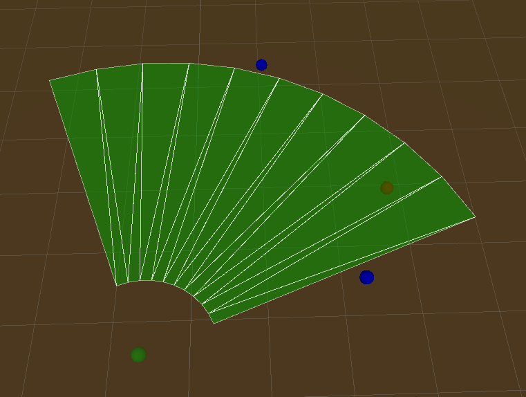

# GizmoMesh

Testing Gizmos.DrawMesh. Drawing circular sector with angle and min, max radius. 

Also there is function (in class Point) to determine is points inside this circular sector.

All values are configured in Config scriptable object.

Objects on scene Main can be moved / rotated (all this in edit mode), point will change their color to red if area contains it.